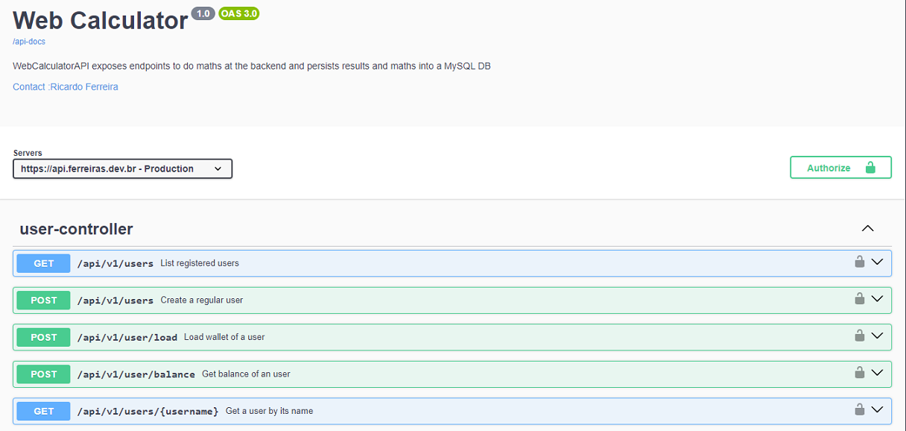

                                                                                                                                                                                                                                                                                                                                                                                                                                                                                                                                                                                                                                                                                                                                                                                                                                                                                                                                                                                                                                                                                                                                                                                                                                                                                                                                                                                                                                                                                                                                                                                                                                                                                                                                                                      **## Take-home Microservices Challenge

This is how we faced the challenge of creating a Web Calculator


## _Table of contents_

- [_Overview_](#overview)
- [_Requirements_](#requirements)
- [_Screenshot_](#screenshot)
- [_Links_](#links)
- [_Built with_](#built-with)
    - [_How I did it_](#how-i-did-it)
- [_Continued development_](#continued-development)
- [_Useful resources_](#useful-resources)
- [_Author_](#author)
- [Acknowledgments](#acknowledgments)

## _Overview_

This app has been coded using Java 21, Spring Boot, Spring JPA, Flyway, Jackson,
Lombok, OpenAPI, MySQL.

- src
    - main
    - java
        - br/dev/ferreiras
            - config
            - controller
            - dto
            - entity
            - enums
            - mapper
            - repository
            - services
                - exceptions
    - resources
        - db.migration
    - test
-

_Requirements_

  ```
  - MySQL Database
  - profile active: dev
  - service socket: 127.0.0.1:8095

```

## _Screenshot_

[]()

## _Links_

- Live Site URL: [https://calculatorweb.ferreiras.dev.br/swagger-ui/index.html]
- Github URL : [https://github.com/rnhc1000/calculatorWeb]

## _Built with_

[](https://skillicons.dev)

## _How I did it_

```java
@Getter
@Entity
@Table (name = "tb_records")
public class Record implements Serializable {
  
  private static final long serialVersionUUID = 1L;

  @Id
  @GeneratedValue (strategy = GenerationType.IDENTITY)
  private Long recordId;

  @NotNull
  private BigDecimal amount;

  private BigDecimal balance;

  private String operationResponse;

  @JoinColumn (name = "operation_id")
  @ManyToOne (cascade = CascadeType.ALL)
  private Long operationId;

  @CreationTimestamp
  private Instant createdAt;

  @ManyToOne (cascade = CascadeType.ALL)
  @JoinColumn (name = "user_id")
  private User userId;

  public Record(Long recordId, BigDecimal amount, BigDecimal balance,
                String operationResponse, Long operationId, Instant createdAt,
                User userId) {
    this.recordId = recordId;
    this.amount = amount;
    this.balance = balance;
    this.operationResponse = operationResponse;
    this.operationId = operationId;
    this.createdAt = createdAt;
    this.userId = userId;
  }

  public Record() {
  }

}
``` 

## _Continued development_

- Unit Tests
- Provide a Json to FrontEnd including
    - delivery status of each operation to frontend
    - count of operations consumed by subscriber
- Subscriber Authentication - OK
    - Spring JWT-OAuth2 - OK
- Records Pagination - OK

### _Useful resources_

- [https://spring.io] Awesome Java framework!.
- [https://start.spring.io/]  Handy startup tool.
- [https://mvnrepository.com] Tools that help tackle the beast

## _Author_

- Website - [https://ferreiras.dev.br]
  _Acknowledgments_
- 
